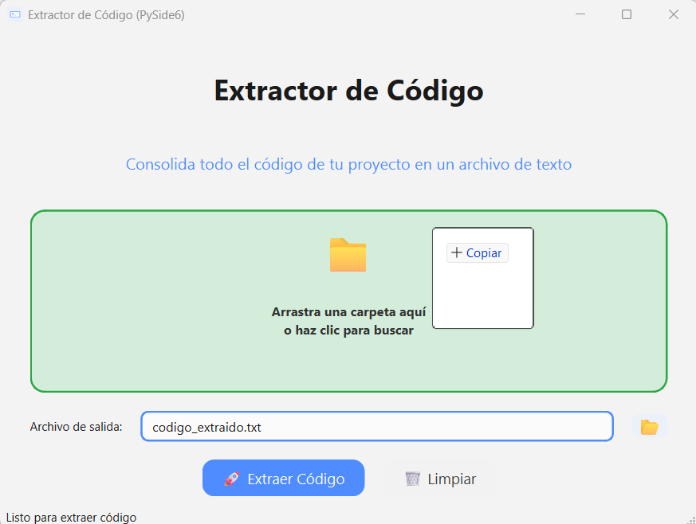
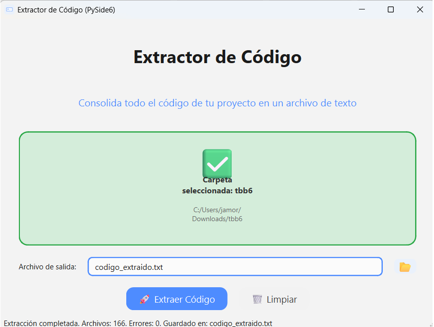

<!-- README.md -->

<p align="center">
  
</p>

<h1 align="center">Code Extractor</h1>

<p align="center">
  <a href="https://github.com/johnitto9/CodeExtractor-PySide6/releases/latest">
    
  </a>
  <a href="https://github.com/johnitto9/CodeExtractor-PySide6/blob/main/LICENSE">
    
  </a>
  <a href="https://pypi.org/project/chardet/">
    
  </a>
  <a href="https://github.com/johnitto9/CodeExtractor-PySide6/actions">
    
  </a>
</p>

<p align="center">
  
</p>

---

## 📋 Table of Contents

- [Features](#✨-features)  
- [Tech Stack](#🛠-tech-stack)  
- [Installation](#🚀-installation)  
- [Usage](#🎬-usage)  
- [Configuration](#⚙-configuration)  
- [Screenshots](#📸-screenshots)  
- [Contributing](#🤝-contributing)  
- [License](#📄-license)  

---

## ✨ Features

- **Drag & Drop** folders straight into the GUI  
- **Recursive scan** of your project, with customizable excludes  
- **Encoding detection** via [chardet]  
- **Real-time progress bar** and cancel button  
- **Preview summary**: total files, sizes, extensions  
- **Single consolidated `.txt`** with all your source code  
- **Cross-platform GUI**: PySide6 **and** CustomTkinter versions  

---

## 🛠 Tech Stack

| Component           | Technology                |
|---------------------|---------------------------|
| GUI                 | PySide6 / CustomTkinter   |
| File & Encoding     | Python 3.x, chardet       |
| Packaging & Testing | pytest, black, flake8     |
| OS Support          | Windows, macOS, Linux     |

---

## 🚀 Installation

```bash
git clone https://github.com/johnitto9/CodeExtractor-PySide6.git
cd CodeExtractor-PySide6
```

1. **Create a virtual environment** (optional but recommended)  
   ```bash
   python -m venv venv
   source venv/bin/activate   # macOS/Linux
   venv\Scripts\activate    # Windows
   ```

2. **Install dependencies**  
   ```bash
   pip install -r requirements.txt
   ```

---

## 🎬 Usage

### Run the PySide6 version
```bash
python main.py
```

### Or run the CustomTkinter version
```bash
python -m gui.main_window
```

1. **Drag & drop** your project folder, or click to browse.  
2. Choose an **output file** (default: `codigo_extraido.txt`).  
3. Click **“Extract Code”** and watch the progress.

---

## ⚙ Configuration

All defaults are in [`config.py`](config.py). You can tweak:

- **Excluded files/folders**  
- **Allowed extensions**  
- **Theme colors**  
- **Max file size**  
- **Output/log filenames**  

```python
# Example: increase max file size
MAX_FILE_SIZE_MB = 20
```

---

## 📸 Screenshots

<p align="center">
  
  &nbsp;&nbsp;
  
</p>

---

## 🤝 Contributing

1. Fork the repo  
2. Create your feature branch  
   ```bash
   git checkout -b feature/YourFeature
   ```  
3. Commit your changes  
   ```bash
   git commit -m "Add awesome feature"
   ```  
4. Push to your branch  
   ```bash
   git push origin feature/YourFeature
   ```  
5. Open a Pull Request  

Please follow PEP 8 + Black style and include tests where applicable.

---

## 📄 License

This project is licensed under the **MIT License** – see [LICENSE](LICENSE) for details.

---

<p align="center">
  Made with ❤️ by [johnitto9](https://github.com/johnitto9)
</p>
